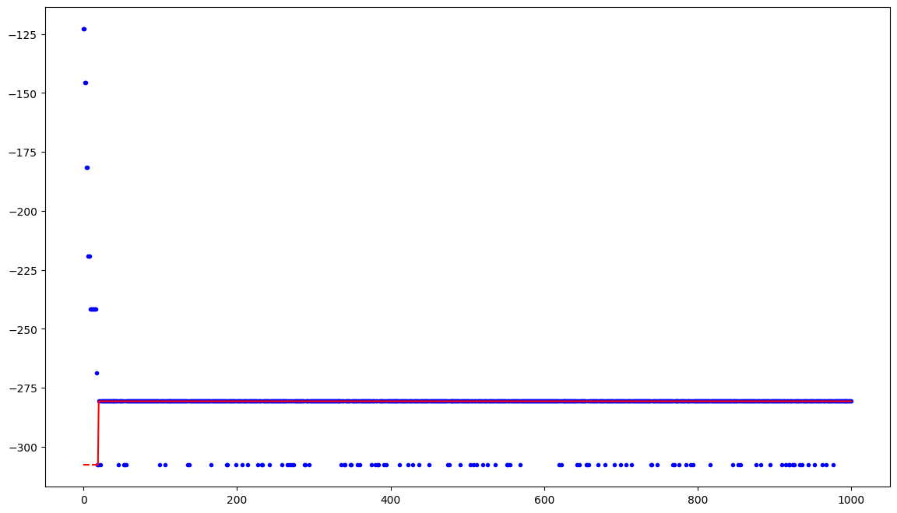
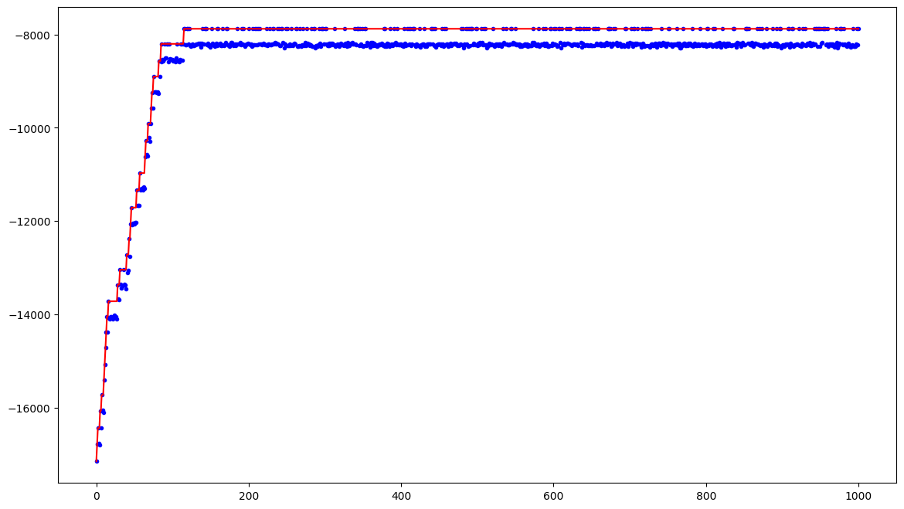
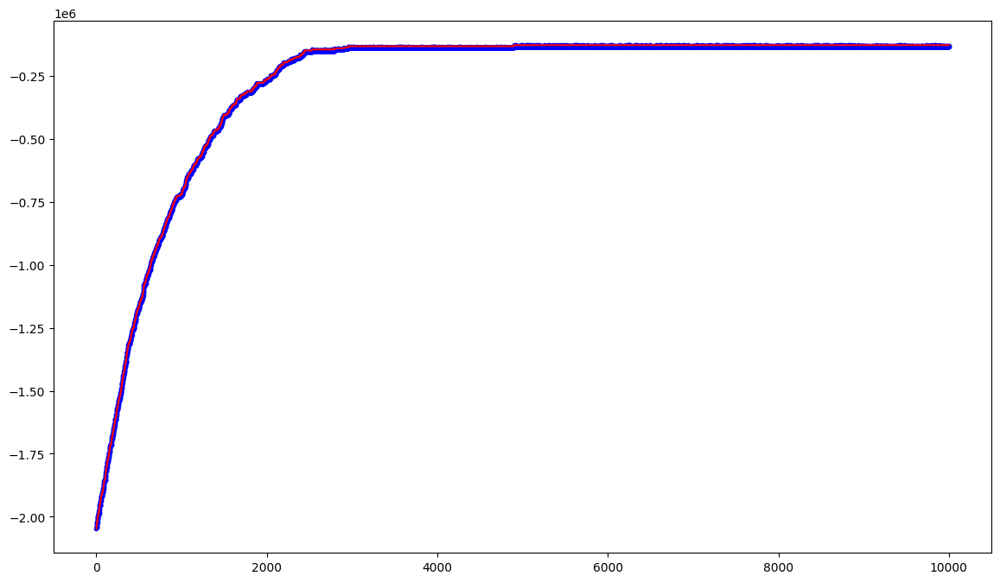
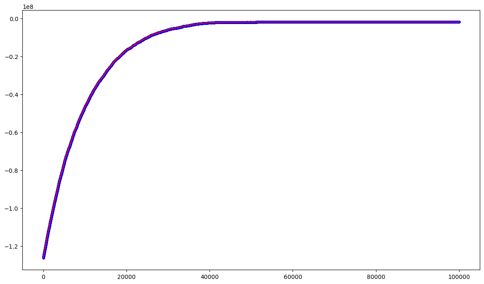
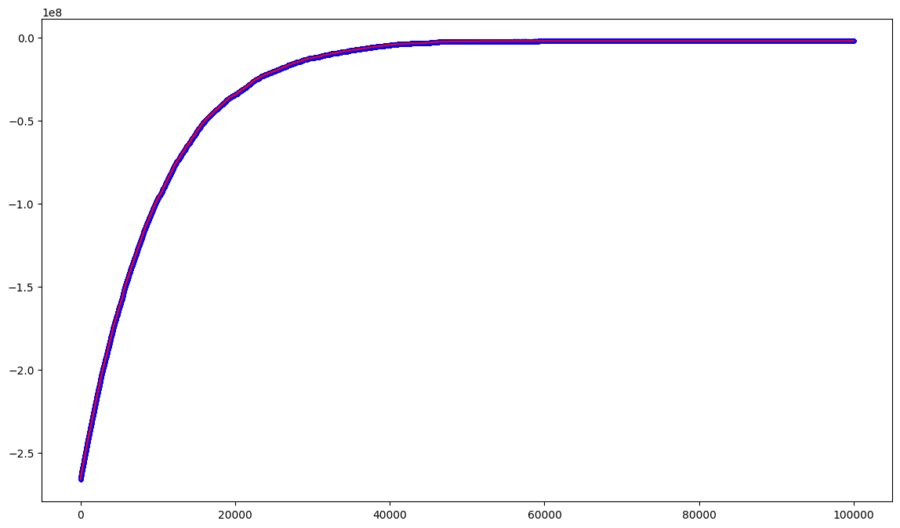
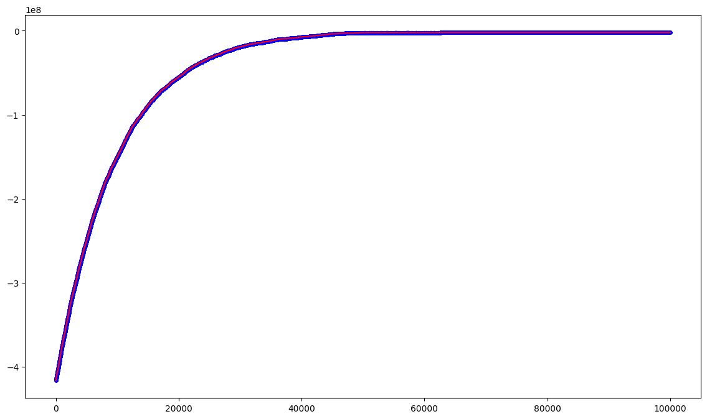

# Lab 1 - Set cover problem

## Repository overview
The official notebook is [set-cover.ipynb](set-cover.ipynb), with a solution based on a single mutation tweak. A speed up has been performed to let instances run in about one minute each, at maximum.

The notebook [strategies.ipynb](strategies.ipynb) contains some scripts with other strategies tried. They are in general much slower than the official solution, but they provide slightly better results in some cases, depending on the instance and, sometimes, on the problem data.

## Official solution
The official solution has the following characteristics:
- **single mutation tweak**: a multiple mutation could be more suitable, but it would prevent to speed up the algorithm;
- **data structure** (called *covering* in the tweak function) keeping track of the number of collected sets each element is covered by: in this way, the algorithm is sped up since the computation of the cost is performed only in the universe dimension;
- **heuristic** to avoid the algorithm searching invalid solutions: given a negative tweak (a set is removed by the current solution), if an element results to be uncovered by the current solution, the modification is rolled back, blocking the path of the algorithm in that region of the fitness landscape;
- **random start**: since the cost is computed using the coverage of the universe by the sets collected in the current solution, the algorithm can start from a random solution, without any specific constraint.

It also contains a code snippet with a **greedy optimization** algorithm, which is able to find an approximate solution of the problem, with a factor proportional to *log(n)* with respect to the optimal one, where *n* is the size of the universe. It is possible to check the results by simply running the notebook.

## Collaborations
The following parts:
- tweak function
- snippet of code for plotting history

have been done in collaboration with [Vincenzo Avantaggiato s323112](https://github.com/VincenzoAvantaggiato). 

## Results
The results are summarized in the following table:

|Instance|Universe size|Number of sets|Density|Number of steps|Cost|
|:--:|:--:  |:--: |:--:|:--: |:--:      |
|1   |100   |10   |0.2 |20   |280.70    |
|2   |1000  |100  |0.2 |115  |7877.12   |
|3   |10000 |1000 |0.2 |4889 |127624.80 |
|4   |100000|10000|0.1 |51355|1939231.02|
|5   |100000|10000|0.2 |59199|2155944.29|
|6   |100000|10000|0.3 |62586|2184591.56|

**Notes**: the columns:
-  *Number of steps*: displays the number of steps necessary to the algorithm to find the (local) optimal solution;
-  *Cost*: displays the cost of the solution found, as absolute value (opposite of fitness, conceptually).
  


# Set Cover problem - Solution

Details about this solution are available in the section "Strategies"

## Imports


```python
from itertools import accumulate
import numpy as np
from tqdm.auto import tqdm
import matplotlib.pyplot as plt

from icecream import ic
```

## Data


```python
# Instances data
universe_sizes = [100, 1000, 10_000, 100_000, 100_000, 100_000]
num_sets_sizes = [10, 100, 1000, 10_000, 10_000, 10_000]
densities = [.2, .2, .2, .1, .2, .3]

# Density of True values in initial solution
INIT_DENSITY = 0.5

# Other useful constants
GREEDY_CFR = True
NUM_INSTANCES = len(universe_sizes)
MIN_INSTANCE = 1
MAX_INSTANCE = NUM_INSTANCES
```

## Generator function


```python
def generate_data(universe_size, num_sets, density):
    SETS = np.random.random((num_sets, universe_size)) < density
    for s in range(universe_size):
        if not np.any(SETS[:, s]):
            SETS[np.random.randint(num_sets), s] = True
    COSTS = np.pow(SETS.sum(axis=1), 1.1)
    
    return SETS, COSTS
```

## Helper functions


```python
def init_sol(num_sets: int) -> np.ndarray:
    solution = np.random.random(num_sets) < INIT_DENSITY
    
    return solution

def valid(sets, solution):
    """Checks wether solution is valid (ie. covers all universe)"""
    phenotype = np.logical_or.reduce(sets[solution])     # at least each element covered by a set
    return np.all(phenotype)                             # all elements are covered

def coverage(sets, solution):
    """Returns the number of covered elements in the universe"""
    phenotype = np.logical_or.reduce(sets[solution])    # at least each element covered by a set
    return np.sum(phenotype)                            # number of covered elements    

def cost(costs, solution):
    """Returns the cost of a solution (to be minimized)"""
    return costs[solution].sum()

def fitness(covering: np.ndarray, costs: np.ndarray, solution: np.ndarray):
    """Returns the fitness of the given solution"""
    return (np.sum(covering > 0), -cost(costs, solution))

# Based on Vincenzo Avantaggiato's version
def tweak(solution: np.ndarray, covering: np.ndarray, sets: np.ndarray) -> np.ndarray:
    """Uses a single mutation method"""
    
    new_sol = solution.copy()
    
    index = np.random.randint(0, solution.shape[0])    
    new_sol[index] = not new_sol[index]
    
    modification = 2*new_sol[index]-1
    
    # Rollbacks the modification (if it is a removal): not allowed to remove a set from the solution
    # if its removal causes an element to become uncovered
    if modification == -1 and np.sum(covering[sets[index]] <= 1):
        return solution
        
    # Store the number of sets covering each element in the universe
    covering += modification * sets[index]
    
    return new_sol
```

## Solver function


```python
def solve_set_cover(sets: np.ndarray, costs: np.ndarray, num_steps: int = 10_000, buf_size: int = 5, init_strength: float = 0.5):
    
    num_sets = sets.shape[0]
    universe_size = sets.shape[1]
    
    solution = init_sol(num_sets)
    best_cov = np.sum(sets[solution], axis=0)
    sol_fitness = fitness(best_cov, costs, solution)
    history = [float(sol_fitness[1])]
    
    # Initially, first valid index is 0 if starting solution is valid , otherwise it is -1
    first_valid = int(sol_fitness[0] == universe_size) - 1
    for i in tqdm(range(num_steps)):
        curr_cov = best_cov.copy()
        current = tweak(solution.copy(), curr_cov, sets)
        
        curr_fitness = fitness(curr_cov, costs, current)
        history.append(float(curr_fitness[1]))
        
        # Mark current index as first valid (index 0 is the initial solution)
        first_valid = i+1 if curr_fitness[0] == universe_size and first_valid == -1 else first_valid
        
        if curr_fitness > sol_fitness:
            sol_fitness = curr_fitness
            solution = current
            best_cov = curr_cov
            
    ic(first_valid)
    steps_sol = history.index(float(sol_fitness[1]))
    
    ic(sol_fitness)
    ic(steps_sol)
    
    plt.figure(figsize=(14,8))
    plt.plot(
        range(first_valid),
        list(np.full(first_valid, history[first_valid])),
        color="red",
        linestyle="--"
    )
    plt.plot(
        range(first_valid, len(history)),
        list(accumulate(history[first_valid :], max)),
        color="red",
    )
    plt.scatter(range(len(history)), history, marker=".", color="blue")
    
    return solution, sol_fitness, steps_sol
    
```

## Greedy optimization
For each iteration, we collect the set that covers the larger number of still uncovered elements. The iterations continue until complete universe coverage is reached.


```python
def solve_greedy(sets: np.ndarray, costs: np.ndarray, num_sets) -> np.ndarray:
    
    solution = np.full(num_sets, False)
    set_matrix = sets.copy()
    covered = 0

    while covered < set_matrix.shape[1]:
        
        largest_index = np.argmax(set_matrix.sum(axis=1))
        largest = set_matrix[largest_index, :]
        solution[largest_index] = True
        covered += largest.sum()
        
        # For each row of the matrix, set to False the corresponding column if the cell of the "largest" vector is True
        # Given the vector corresponding to the coverings for the larger set (to collect),
        # it removes all possible coverings for those elements covered by this set,
        # in order to ignore them in next steps
        set_matrix *= np.logical_not(largest)
    
    sol_fitness = fitness(np.sum(sets[solution], axis=0), costs, solution)
    
    return solution, sol_fitness
```

## Solver caller


```python

# Calls solver function (and greedy optimization, if requested) once for each instance
for (i, (universe_size, num_sets, density)) in \
    list(enumerate(zip(universe_sizes, num_sets_sizes, densities))) [MIN_INSTANCE-1 : MAX_INSTANCE]:

    instance_msg = f"Instance {i + 1}"
    
    ic(instance_msg)

    sets, costs = generate_data(universe_size, num_sets, density)
    
    num_steps = 100_000 if i > 2 else (10_000 if i == 2 else 1000)
    
    solution, (sol_state, sol_fitness), sol_steps = solve_set_cover(sets, costs, num_steps=num_steps)
    
    if GREEDY_CFR:
        greedy_sol, (greedy_state, greedy_fitness) = solve_greedy(sets, costs, num_sets)
    
    ic(sol_state, sol_fitness)
    
    if GREEDY_CFR:
        ic(greedy_state, greedy_fitness)
    
```

    ic| instance_msg: 'Instance 1'
    


      0%|          | 0/1000 [00:00<?, ?it/s]


    ic| first_valid: 18
    ic| sol_fitness: (np.int64(100), np.float64(-280.69985830089905))
    ic| steps_sol: 20
    ic| sol_state: np.int64(100)
        sol_fitness: np.float64(-280.69985830089905)
    ic| greedy_state: np.int64(100)
        greedy_fitness: np.float64(-280.69985830089905)
    ic| instance_msg: 'Instance 2'
    


      0%|          | 0/1000 [00:00<?, ?it/s]


    ic| first_valid: 0
    ic| sol_fitness: (np.int64(1000), np.float64(-7877.119696252716))
    ic| steps_sol: 115
    ic| sol_state: np.int64(1000)
        sol_fitness: np.float64(-7877.119696252716)
    ic| greedy_state: np.int64(1000)
        greedy_fitness: np.float64(-6070.924701997821)
    ic| instance_msg: 'Instance 3'
    


      0%|          | 0/10000 [00:00<?, ?it/s]


    ic| first_valid: 0
    ic| sol_fitness: (np.int64(10000), np.float64(-127624.79711095142))
    ic| steps_sol: 4899
    ic| sol_state: np.int64(10000)
        sol_fitness: np.float64(-127624.79711095142)
    ic| greedy_state: np.int64(10000)
        greedy_fitness: np.float64(-100385.86553148976)
    ic| instance_msg: 'Instance 4'
    


      0%|          | 0/100000 [00:00<?, ?it/s]


    ic| first_valid: 0
    ic| sol_fitness: (np.int64(100000), np.float64(-1939231.0211132378))
    ic| steps_sol: 51355
    ic| sol_state: np.int64(100000)
        sol_fitness: np.float64(-1939231.0211132378)
    ic| greedy_state: np.int64(100000)
        greedy_fitness: np.float64(-1520626.810680374)
    ic| instance_msg: 'Instance 5'
    


      0%|          | 0/100000 [00:00<?, ?it/s]


    ic| first_valid: 0
    ic| sol_fitness: (np.int64(100000), np.float64(-2155944.2910249243))
    ic| steps_sol: 59199
    ic| sol_state: np.int64(100000)
        sol_fitness: np.float64(-2155944.2910249243)
    ic| greedy_state: np.int64(100000)
        greedy_fitness: np.float64(-1730831.0402739164)
    ic| instance_msg: 'Instance 6'
    


      0%|          | 0/100000 [00:00<?, ?it/s]


    ic| first_valid: 0
    ic| sol_fitness: (np.int64(100000), np.float64(-2184591.558418671))
    ic| steps_sol: 62586
    ic| sol_state: np.int64(100000)
        sol_fitness: np.float64(-2184591.558418671)
    ic| greedy_state: np.int64(100000)
        greedy_fitness: np.float64(-1774346.3401856327)
    


    

    


    

    


    

    


    

    


    

    


    

    

# Set cover problem - Strategies

Bunch of different strategies implemented to solve set cover problem (only trying here)


```python
from itertools import accumulate
import numpy as np
from tqdm.auto import tqdm
import matplotlib.pyplot as plt

from icecream import ic
```

## Reproducible Initialization

If you want to get reproducible results, use `rng` (and restart the kernel); for non-reproducible ones, use `np.random`.


```python
UNIVERSE_SIZE = 1000
NUM_SETS = 100
DENSITY = 0.2

rng = np.random.Generator(np.random.PCG64([UNIVERSE_SIZE, NUM_SETS, int(10_000 * DENSITY)]))
```


```python
# DON'T EDIT THESE LINES!

SETS = np.random.random((NUM_SETS, UNIVERSE_SIZE)) < DENSITY
for s in range(UNIVERSE_SIZE):
    if not np.any(SETS[:, s]):
        SETS[np.random.randint(NUM_SETS), s] = True
COSTS = np.pow(SETS.sum(axis=1), 1.1)
```

## Instances generation

### Data


```python
universe_sizes = [100, 1000, 10_000, 100_000, 100_000, 100_000]
num_sets_sizes = [10, 100, 1000, 10_000, 10_000, 10_000]
densities = [.2, .2, .2, .1, .2, .3]

INIT_SOL_TH = 1
```

### Generator function


```python
def generate_data(universe_size, num_sets, density):
    SETS = np.random.random((num_sets, universe_size)) < density
    for s in range(universe_size):
        if not np.any(SETS[:, s]):
            SETS[np.random.randint(num_sets), s] = True
    COSTS = np.pow(SETS.sum(axis=1), 1.1)
    
    return SETS, COSTS
```

## Helper Functions


```python
def valid(sets, solution):
    """Checks wether solution is valid (ie. covers all universe)"""
    phenotype = np.logical_or.reduce(sets[solution])     # at least each element covered by a set
    return np.all(phenotype)                             # all elements are covered

def coverage(sets, solution):
    """Returns the number of covered elements in the universe"""
    phenotype = np.logical_or.reduce(sets[solution])    # at least each element covered by a set
    return np.sum(phenotype)                            # number of covered elements    

def cost(costs, solution):
    """Returns the cost of a solution (to be minimized)"""
    return costs[solution].sum()

def fitness(sets: np.ndarray, costs: np.ndarray, solution: np.ndarray):
    """Returns the fitness of the given solution"""
    return (coverage(sets, solution), -cost(costs, solution))
```


```python
def single_mutation(solution: np.ndarray):
    pos = rng.integers(0, solution.shape[0])
    solution[pos] = not solution[pos]
    return solution

def multiple_mutation(solution: np.ndarray):
    mask = rng.random(solution.shape[0]) < 0.99
    new_solution = np.logical_xor(mask, solution)
    return new_solution

def multiple_mutation_strength(solution: np.ndarray, strength: float = 0.3) -> np.ndarray:
    mask = rng.random(solution.shape[0]) < strength
    if not np.any(mask):
        mask[np.random.randint(solution.shape[0])] = True
        
    new_sol = np.logical_xor(solution, mask)
    
    return new_sol
```

### RM hill climbing with single mutation


```python
def solve_single_mutation_HC(sets, costs, num_sets, num_steps=10_000, th=INIT_SOL_TH):
    
    history = []
    solution = rng.random(num_sets) < INIT_SOL_TH
    sol_fitness = fitness(sets, costs, solution)

    print(f"Initial fitness: {sol_fitness}")

    history.append(float(sol_fitness[1]))
    for _ in tqdm(range(num_steps)):
        current = single_mutation(solution.copy())
        curr_fitness = fitness(sets, costs, current)
        
        #print(curr_fitness, sol_fitness)
        
        history.append(float(curr_fitness[1]))
        if curr_fitness > sol_fitness:
            solution = current
            sol_fitness = curr_fitness

    print(f"Final fitness: {sol_fitness}")
    print(f"Last update at iteration {history.index(float(sol_fitness[1]))}")

    plt.figure(figsize=(14, 8))
    plt.plot(
        range(len(history)),
        list(accumulate(history, max)),
        color="red",
    )
    _ = plt.scatter(range(len(history)), history, marker=".")
    
    return sol_fitness
```

### RM hill climbing with multiple mutation


```python
def solve_multiple_mutation_HC(sets, costs, num_sets, num_steps=10_000, th=INIT_SOL_TH):
    history = []
    solution = rng.random(num_sets) < th
    sol_fitness = fitness(sets, costs, solution)

    print(f"Initial fitness: {sol_fitness}")

    history.append(sol_fitness[1])
    for _ in tqdm(range(num_steps)):
        current = single_mutation(solution.copy())
        curr_fitness = fitness(sets, costs, current)
        
        #print(curr_fitness, sol_fitness)
        
        history.append(curr_fitness[1])
        if curr_fitness > sol_fitness:
            solution = current
            sol_fitness = curr_fitness

    print(f"Final fitness: {sol_fitness}")
    print(f"Last update at iteration {history.index(float(sol_fitness[1]))}")

    plt.figure(figsize=(14, 8))
    plt.plot(
        range(len(history)),
        list(accumulate(history, max)),
        color="red",
    )
    plt.scatter(range(len(history)), history, marker=".")
    
    return sol_fitness
```

### Simulated annealing
It seems to perform worst than a RMHC: too much going around and not exploit neighboring solutions.


```python
def solve_simulated_annealing_HC(sets, costs, num_sets, num_steps=10_000, th=INIT_SOL_TH):
    
    def complete(covered):
        return covered == sets.shape[1]
    
    history = []
    solution = rng.random(num_sets) < th
    sol_fitness = fitness(sets, costs, solution)
    final_sol_fitness = sol_fitness

    print(f"Initial fitness: {sol_fitness}")

    history.append(sol_fitness[1])
    for i in tqdm(range(num_steps)):
        current = multiple_mutation(solution.copy())      # using single mutation to avoid too much exploration
        curr_fitness = fitness(sets, costs, current)
        
        # Exploring when high coverage, exploiting otherwise
        # Min temperature set to 1 to avoid numerical issues in scalar power
        temperature = max(1, 10 * (sol_fitness[0] / sets.shape[1]) + 0.01)
        
        history.append(curr_fitness[1])
        
        logp = (curr_fitness[1] - sol_fitness[1]) / temperature + 1e-6
            
        if curr_fitness < sol_fitness and np.log(rng.random() + 1e-6) < logp or curr_fitness > sol_fitness:
            
            if curr_fitness > final_sol_fitness and complete(curr_fitness[0]):
                final_sol_fitness = curr_fitness
            
            sol_fitness = curr_fitness
            solution = current

    print(f"Final fitness: {final_sol_fitness}")
    print(f"Last update at iteration {history.index(final_sol_fitness[1])}")

    plt.figure(figsize=(14, 8))
    plt.plot(
        range(len(history)),
        list(accumulate(history, max)),
        color="red",
    )
    plt.scatter(range(len(history)), history, marker=".", color="blue")
    
    return final_sol_fitness
```

### Simulated annealing with linear self-adaption
Simulated annealing approach but with linear self-adaption. The parameter *strength*, that acts as *temperature*, is increased (or decreased) by a 20% factor, depending on the success of at least one trial out of last five ones.


```python
def solve_linear_SAHC(sets, costs, num_sets, num_steps=10_000, buf_size=5):
    history = []
    buffer = []
    solution = np.full(num_sets, True)
    sol_fitness = fitness(sets, costs, solution)

    ic(sol_fitness)
    history.append(float(sol_fitness[1]))

    strength = 0.5

    for steps in tqdm(range(num_steps)):
        
        new_sol = multiple_mutation_strength(solution, strength)
        new_sol_fitness = fitness(sets, costs, new_sol)
        
        history.append(float(new_sol_fitness[1]))
        
        buffer.append(new_sol_fitness > sol_fitness)
        buffer = buffer[-buf_size: ]
        
        if sum(buffer) > 1:
            strength *= 1.2
            
        elif sum(buffer) == 0:
            strength /= 1.2
        
        if new_sol_fitness > sol_fitness:
            solution = new_sol
            sol_fitness = fitness(sets, costs, solution)
            
    ic(sol_fitness)
    ic(history.index(sol_fitness[1]))

    plt.figure(figsize=(14, 8))
    plt.plot(
        range(len(history)),
        list(accumulate(history, max)),
        color="red",
    )
    plt.scatter(range(len(history)), history, marker=".")
    
    return sol_fitness
```

## General solver
Script to solve task with multiple strategies and perform comparisons


```python
class Strategies:
    SINGLE_MUTATION_HC = "Single mutation hill climber"
    MULTIPLE_MUTATION_HC = "Multiple mutation hill climber"
    SIMULATED_ANNEALING_EXP = "Simulated annealing hill climber - Exponential adaption"
    SIMULATED_ANNEALING_LINEAR = "Simulated annealing hill climber - Linear adaption"
    
    def to_list():
        return [
            Strategies.SINGLE_MUTATION_HC,
            Strategies.MULTIPLE_MUTATION_HC,
            Strategies.SIMULATED_ANNEALING_EXP,
            Strategies.SIMULATED_ANNEALING_LINEAR
        ]

def solve(sets: np.ndarray, costs: np.ndarray, strategy: str):
    n = sets.shape[0]
    u = sets.shape[1]
    steps = int(min(10_000, max(n*u // 50, 100)))
    th_start = 0.95 if n < 1000 else INIT_SOL_TH
    match strategy:
        case Strategies.SINGLE_MUTATION_HC:
            return solve_single_mutation_HC(sets, costs, n, num_steps=steps)
        case Strategies.MULTIPLE_MUTATION_HC:
            return solve_multiple_mutation_HC(sets, costs, n, num_steps=steps)
        case Strategies.SIMULATED_ANNEALING_EXP:
            return solve_simulated_annealing_HC(sets, costs, n, num_steps=10_000)
        case Strategies.SIMULATED_ANNEALING_LINEAR:
            return solve_linear_SAHC(sets, costs, n)
```


```python
for (i, (universe_size, num_sets, density)) in list(enumerate(zip(universe_sizes, num_sets_sizes, densities)))[:3]:

    print(f"Generating instance {i+1}")

    SETS, COSTS = generate_data(universe_size, num_sets, density)

    print(f"Solving instance {i+1}")
    
    fitnesses = {}
    for strategy_name in Strategies.to_list():
        fitnesses[strategy_name] = solve(SETS, COSTS, strategy_name)
        plt.show()

    for (strategy, fitness_val) in fitnesses.items():
        print(f"{strategy}: {fitness_val}")
```

# Set cover problem - Issues done
To: Alessandro Di Matteo

Vanilla single-mutation Hill Climbing is correctly implemented, but it has its known limitations due to lack of exploration.

Simulated annealing is good too, maybe the only improvement could be using a linear relationship between temperature and probabilty
of accepting a worsening solution, instead of an exponential one. This strategy seems to have a great potential if run for more
iterations, as you can see in your final plot.

The variant with iterated local search may perform better if the restart point would be a global one, instead of the current best
solution: in this way, the algorithm would be more oriented on exploration and it may escape some local maximum. Note that its plot
is very similar to the first strategy one, thus they are maybe stuck in the same local maximum. Moreover, doing more repetitions
(restarts) could lead to better results, even if time complexity is a though problem here.

The self-adaptive variant gets similar results as simulated annealing with exponential adaptive temperature (second strategy). Here,
you can try multiplicating strenght instead of summing a fixed quantity, in order to have a variation proportional to the previous
value. By the way, these two algorithms have a similar structure and principles (alternate exploration and exploitation in some way),
but the second one may be better after many iterations: unfortunately, the only way to know is to run it more!


To: Anjali Vaghjiani

Your solution is not related to set cover, but to knapsack problem.
Anyway, it is a good and quite effective solution, which could be further improved by using simulated annealing with possibly a
self-adaptive strategy.