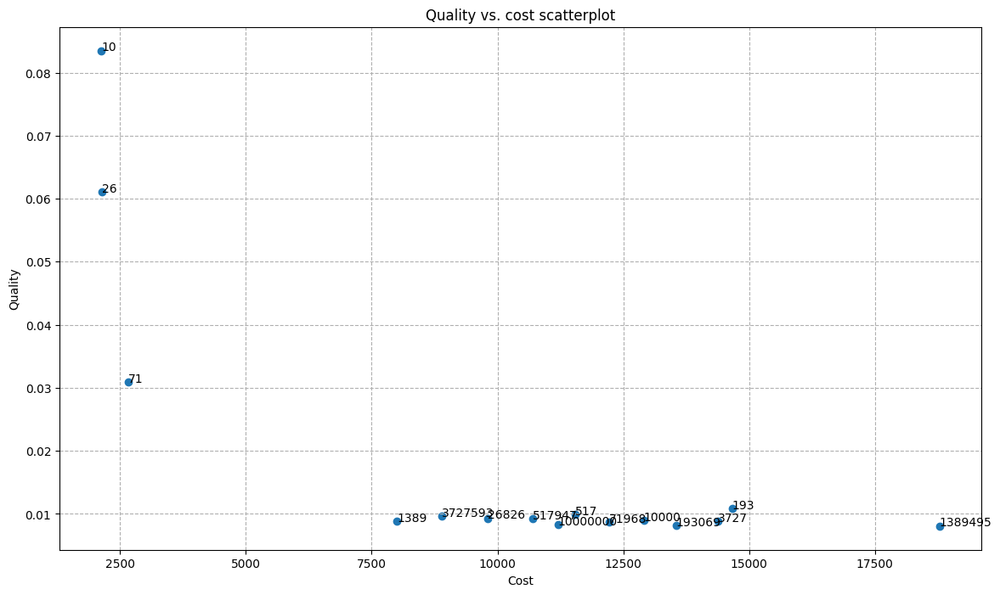
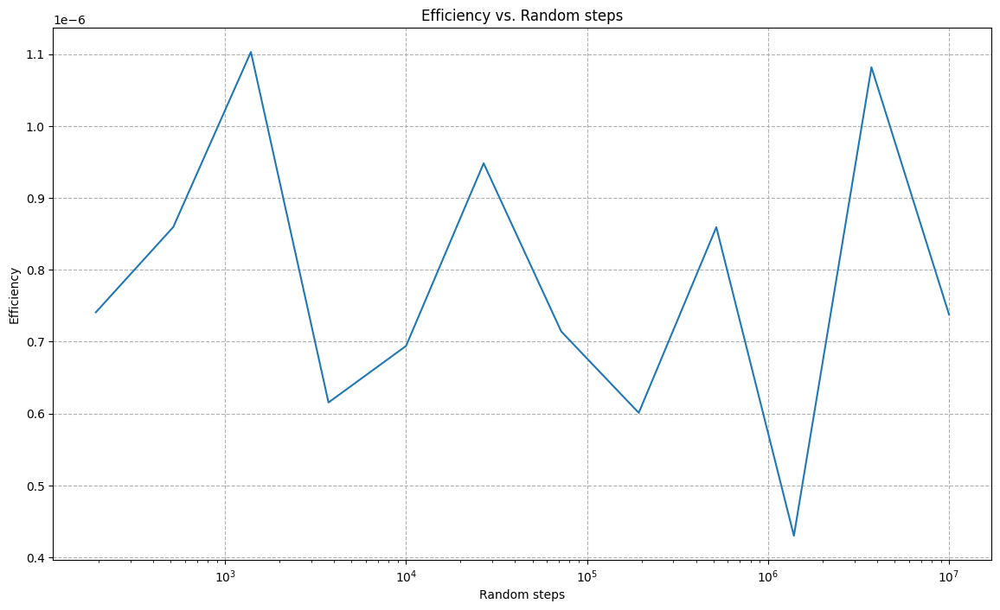
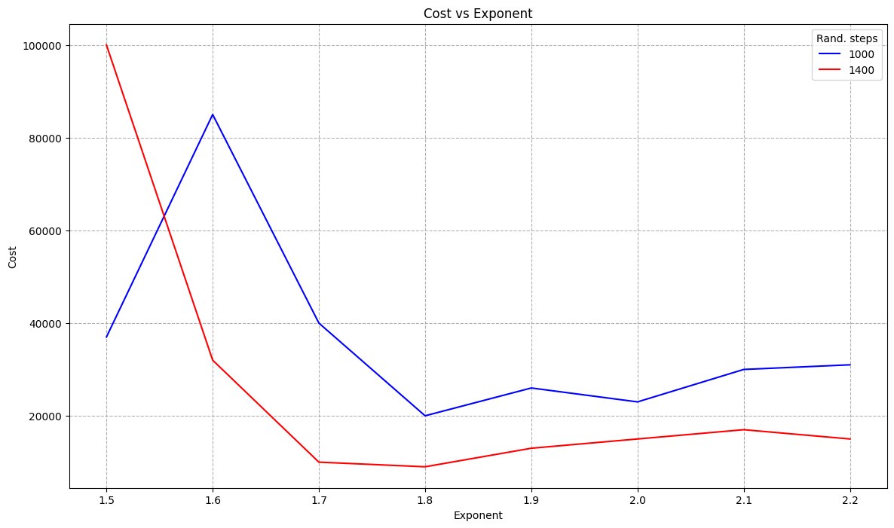
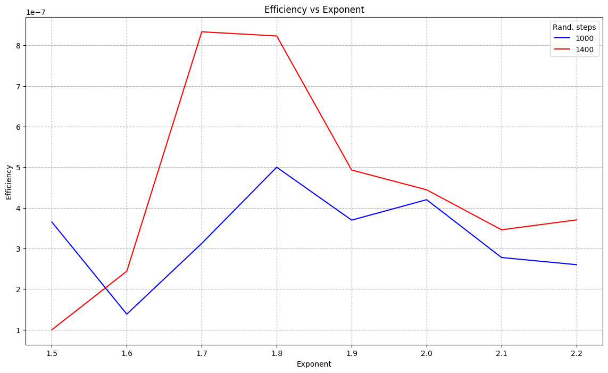
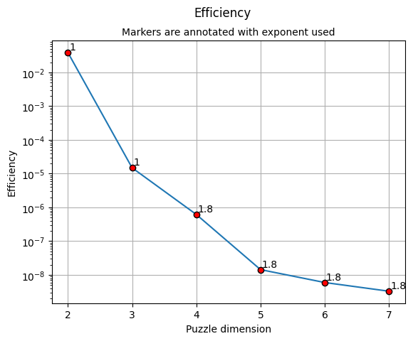

# Lab 3 - N-puzzle problem

## Repository overview
The solution for this problem is implemented in the section "Solution".

## Official solution
The solution is given using A* approach for size N, such that $2 \leq N \leq 7$. Larger problems have time issues.

### Problem initialization
Since the game is not guaranteed to have a valid solution (and we want how algorithm to converge), the initialization is implemented by starting from the final *goal* configuration and randomly perform actions to move the empty tile in other positions.

The result of this operation is set as the initial state of the problem.

### Metrics
The following metrics are used:
- **quality**: measures how good a solution is, defined as: $quality(p) = \frac{1}{|p|}$, where *p* is the solution path
- **cost**: measures how much the algorithm has explored the state space to find the final solution, defined as: $cost(p) = |A|$, where *A* is the set of performed actions, that is equal to the number of calls to the *do_action* function
- **efficiency**: measures how good a solution is, with respect to the number of explored states and it is defined as: $efficiency(p) = \frac{quality(p)}{cost(p)}$. It is better when larger. Since the goal is to maximize efficiency, we look for solutions that maximize quality (thus, that minimize solution path length) and minimize cost.

### A* approach
A* allows to find the best solution in path search if an admissible heuristic is defined, by working in an informed way. 

However, for $N \gt 3$, admissible heuristics converge too slowly, thus a trade-off between optimality a convergence is needed. To figure out how to set the parameters of the problem, that are:
- type of heuristic to use, eventually scheduled
- initial random steps
- parameters of the heuristic chosen

some experiments have been carried out.

#### Experiments
The following experiments are focused on understanding how the variation of one of the previously mentioned parameters can influence the final result. They have been executed on 4-sized problem.

##### Heuristic type
In this experiment, different heuristics are used, both fixed and scheduled. They are the following:
- **exponential manhattan distance**: the sum of all manhattan distances of each tile position to their goal position is summed and raised to an exponent $e \in \{2,3\}$
- **step scheduled manhattan distance**: similar to the previous one, but the exponent is tuned depending on parameters *STEP_SIZE* and *TEMPERATURE*
- **arctan scheduled manhattan distance**: similar to the previous one, but the exponent is tuned smoothly, depending on *arctan* function and a *STEP_SIZE* parameter

The experiment is carried out on 15 different trials, and the results are averaged among them.

It is shown that:
- step scheduling is the best solution in terms of quality 
- exponential fixed heuristic (with $e = 2$) is the best solution in terms of both cost and efficiency, thus it is chosen as baseline for the next experiments


##### Initial random steps
The main focus of this experiment is to figure out if (and how) the value of the initial random steps influences the final result, in terms of cost, quality and efficiency. In particular, the main interest is to discover if values larger than a certain threshold produce similar results, and which are the best among them.

This experiments explores values of random steps in a logarithmic space, performing 15 trials. For each of them, 10 trials are again executed, to average the final results on different initial states, created using the same amount of random steps.

The results highlight that the quality of the solution is independent from the number of random steps, for values larger than 200. To have a safe margin, 1000 is chosen as lower bound. 


Since cost is influenced by the initial random steps, the efficiency has a variable trend, with some minimums around 1400, 200'000 and 1'000'000.



However, 200'000 and 1'000'000 are associated with higher costs, thus they are discarded for the next experiment: since these parameters are been tuned only on 4x4, it is better to be more conservative and prioritize cost instead of efficiency here.

##### Heuristic parameter
In the code experiments is tried to figure out the best exponent for the heuristic chosen, together with the best value of initial random steps, chosen among the values found before. In particular, 1000 is tried anyway, due to both its closeness to 1400 and the very low cost of this solution (here a 4x4 game is used, but it is necessary to find a good exponent to make this approach as scalable as possible). 

This experiment is carried out on 10 different trials for each value of initial random steps. For each of these trials, 8 values of exponents are used, such that $1.5 \leq e \leq 2.2$.

The results are collected for each value of initial random steps and exponent, and are averaged on trials.
In the following plot, we can put an upper bound for cost at 20'000 (which corresponds to about 4 seconds execution), for the same conservative reason as above; the following exponent values are selected:
- 1000 random steps: $e = 1.8$, which is the minimum
- 1400 random steps: $e \geq 1.7$, where the minimum corresponds to $e = 1.8$



By considering efficiency, it is clear how much using 1400 random steps could be better in general, with a larger improvement around 1.7-1.8



Finally, the following setup is chosen:
- random steps: 1400
- exponent: 1.8

#### Solution
##### Setup
Summing up the experiments result, these are the parameters values for the algorithm:
- initial random steps: 1400
- heuristic function:  $h(state) = [\sum_{i=1}^{N} \sum_{j=1}^{N} manhattanDistance(state_{i,j}, goal_{i,j})]^{1.8}$ 

where $goal_{i,j}$ is the goal position for the tile contained in $state_{i,j}$

##### Procedure
The algorithm is evaluated on different number of trials, depending on the size of the problem. Each trial starts from a different initial state, but they all share the same goal state, initial random steps and heuristic function.

The results (quality, cost) are averaged on all trials, for a single size instance of the problem; then, efficiency is computed as the ratio of these average values. A more detailed view of the results is provided in subsection "Results".

##### Data structures
Inside the A* algorithm, the following data structures are used:
- **open_set**: set of states to visit, but not yet explored, implemented with a min-heap structure to emulate a priority queue; each entry contains three fields:
  - *cost*: the total cost $f(n) = g(n) + h(n)$, used to keep the order among the states
  - *state*: the state matrix of the node, implemented as a *State* class, to provide hashability for NumPy arrays 
  - *path*: the path to reach the current node, starting from the initial state
- **closed_set**: set of states already visited
- **past_len**: map of states already visited, together with the deterministic cost *g(n)*

##### Algorithm
The algorithm follows these steps:
1) Initialization: the initial state is put in the open and closed set, and its cost *g(n)* is set to 0
2) Iterate until *open_set* is empty:
   1) The top state of heap is extracted: it is the one with the minimum total cost *f(n)*
   2) If this state is the goal state, the algorithm has converged and returns the path
   3) Otherwise, the algorithm iterates over the possible actions, (which depend on the position), finding the neighbors of the current state; only if a neighbor has not been visited yet or its current cost *g(n)* is worst (larger) than the one it would have if passing from the current node, the following actions are performed:
      1)   Update the cost *g(n)* for the neighbor: $g(neighbor) = g(current) + 1$
      2)   Compute the new cost *f(n)* for the neighbor: $f(neighbor) = g(neighbor) + h(neighbor)$
      3)   Insert the current neighbor, as (*f(neighbor)*, neighbor state, path + current action) in the *open_set*, respecting the ordering property
      4)   Insert the current neighbor in the *closed_set*
3) If the algorithm arrives here means that the open set is empty and the goal state has not been reached: this should not happen, since the initial state is created by performing a finite number of actions from the goal state; thus, there should exists a path from the chosen initial state to the goal state.


## Results
The results are summarized in the following table:

|Problem size   |Quality|Cost|Efficiency|Trials|
|:-----:        |:--: |:--:|:--: |:--:|
|2              |0.2941 |7.6        |3.87e-02 |10   |
|3              |0.0476 |3197.8     |1.49e-05 |10  |
|4              |0.0083 |13452      |6.17e-07 |10 |
|5              |0.0036 |253725.2   |1.44e-08 |5|
|6              |0.0026 |433519.5   |5.96e-09 |2|
|7              |0.0018 |548205     |3.29e-09 |1|

The following plot shows the trend of the efficiency, and it provides annotations for the exponent used in the heuristic



## Observations
We can observe that efficiency decreases as the puzzle dimension, probably due to:
- from N = 2 to N = 3, the huge relative increase of the search space
- from N = 3 to N = 4, the usage of a non-admissible heuristic: it allows to compute a solution in reasonable time, but it is sub-optimal
- from N = 4 onwards, the limited number of trials may lead to biased solutions

## Collaborations
The following parts:
- basic idea behind heuristic exponentiation
- priority queue implementation

have been done in collaboration with [Vincenzo Avantaggiato s323112](https://github.com/VincenzoAvantaggiato). 

# Lab 3 - N-puzzle Solution

## Imports
```python
from collections import namedtuple
from random import choice
from tqdm.auto import tqdm
import numpy as np
from heapq import heappush, heappop
import functools
import matplotlib.pyplot as plt
from time import time
import json
```

## Reproducibility

```python
np.random.seed(42)
```

## Constants
```python
PUZZLE_DIM = 4
RANDOMIZE_STEPS = 10_000
STEP_SIZE = 1000
TEMPERATURE = 10
MIN_PUZZLE_DIM = 2
MAX_PUZZLE_DIM = 7
TRIALS_BASE = 10
OUTFILE = "out.json"

action = namedtuple('Action', ['pos1', 'pos2'])
```

### State
Class to make a numpy array hashable


```python
class State:
    def __init__(self, content: np.ndarray):
        self.content: np.ndarray = content
        self.hash: int = hash(content.tobytes())
        
    def __hash__(self):
        return self.hash

    def __eq__(self, other):
        return self.hash == other.hash
    
    def __lt__(self, other):
        return self.hash < other.hash
```

### Actions


```python
def available_actions(state: np.ndarray) -> list['Action']:
    puzzle_dim = state.shape[0]
    x, y = [int(i[0]) for i in np.where(state == 0)]
    actions = list()
    if x > 0:
        actions.append(action((x, y), (x - 1, y)))
    if x < puzzle_dim - 1:
        actions.append(action((x, y), (x + 1, y)))
    if y > 0:
        actions.append(action((x, y), (x, y - 1)))
    if y < puzzle_dim - 1:
        actions.append(action((x, y), (x, y + 1)))
    return actions

def counter(fn):

    @functools.wraps(fn)
    def helper(*args, **kargs):
        helper.calls += 1
        return fn(*args, **kargs)

    helper.calls = 0
    return helper

@counter
def do_action(state: np.ndarray, action: 'Action') -> np.ndarray:
    new_state = state.copy()
    new_state[action.pos1], new_state[action.pos2] = new_state[action.pos2], new_state[action.pos1]
    return new_state
```

## A* algorithm 

### Distance computation
Sum of Manhattan distances, eventually exponentiated


```python
def get_pos(state_content: np.ndarray, n: int) -> tuple[int, int]:
    x, y = np.argwhere(state_content== n)[0]
    return x, y

def manhattan_distance(state: np.ndarray, goal: np.ndarray, n: int, p: float = 1) -> int:
    x1, y1 = get_pos(state, n)
    x2, y2 = get_pos(goal, n)
    return (abs(x1 - x2) + abs(y1 - y2)) ** p
```

### Heuristics
Only *fixed_heuristic* is used in the final solution, as observed in the [experiments](#experiments)


```python
def fixed_heuristic(state: np.ndarray, goal: np.ndarray, step: int = None, exp: float = None, p: float = 1) -> int:
    puzzle_dim = state.shape[0]
    return sum([manhattan_distance(state, goal, n, p=p) for n in range(1, puzzle_dim**2)]) ** exp

def step_scheduling_heuristic(state: np.ndarray, goal: np.ndarray, step: int = TEMPERATURE * STEP_SIZE, exp: float = None) -> int:
    puzzle_dim = state.shape[0]
    return sum([manhattan_distance(state, goal, n) for n in range(1, puzzle_dim**2)]) ** (min(1 + (step // STEP_SIZE) / TEMPERATURE, 2))

def arctan_scheduling_heuristic(state: np.ndarray, goal: np.ndarray, step: int = TEMPERATURE * STEP_SIZE, exp: float = None) -> int:
    puzzle_dim = state.shape[0]
    return sum([manhattan_distance(state, goal, n) for n in range(1, puzzle_dim**2)]) ** (np.arctan(step / STEP_SIZE) + 1)
```

### Metrics
Quality is the inverse of path length. If path length is zero (the state is already the goal) is set to the cost.

Cost is the number an action is performed


```python
def quality(solution: list[int]) -> int:
    return 1 / len(solution) if solution else cost()

def cost() -> int:
    return do_action.calls
```

### Algorithm


```python
def astar(state: np.ndarray, goal: np.ndarray, heuristic, exp = 1) -> tuple[bool, list['Action']]:
    
    path_len = lambda x: len(x)		# directly defined here to avoid numerical issues if using quality definition

    state, goal = map(State, [state, goal])
    open_set = []
    closed_set = set()
    past_len = {state: 0}
 
    heappush(open_set, (0, state, []))
    closed_set.add(state)

    steps = 0
    while open_set:
        
        _, current, curr_path = heappop(open_set)

        # Only for logging
        if steps % 10000 == 0:
            print(f"steps: {steps}, open: {len(open_set)}, closed: {len(closed_set)}, dist: {fixed_heuristic(current.content, goal.content, exp=1, p=1)}, len: {len(curr_path)}")

        if current == goal:
            return True, curr_path

        for action in available_actions(current.content):
            neighbor = State(do_action(current.content, action))

            if neighbor not in closed_set or past_len[current] + 1 < past_len[neighbor]:
                past_len[neighbor] = path_len(curr_path) + 1
                cost = past_len[neighbor] + heuristic(neighbor.content, goal.content, step=steps, exp=exp)
                heappush(open_set, (cost, neighbor, curr_path + [action]))
                closed_set.add(neighbor)

        steps += 1
    
    # It should not arrive here!
    return False, []
```

### Initialization functions


```python
def init_state(goal: np.ndarray, puzzle_dim: int = PUZZLE_DIM, randomize_steps=RANDOMIZE_STEPS) -> np.ndarray:
    state = goal.copy()
    np.random.shuffle(state.flatten())
    for _ in range(randomize_steps):
        state = do_action(state, choice(available_actions(state)))
    return state.reshape(puzzle_dim, puzzle_dim)

def set_goal(puzzle_dim: int) -> np.ndarray:
    goal = np.array([n for n in range(1, puzzle_dim**2)] + [0])
    return goal.reshape((puzzle_dim, puzzle_dim)) 
```

### Statistics computation
Quality, cost and elapsed time are computed. Useful in particular for experiments


```python
def statistics(results_values):
    quality_sol, cost_sol, elapsed = tuple(zip(*(results_values)))
    avg_quality, avg_cost, avg_elapsed = map(lambda x: np.mean(np.array(x)), [quality_sol, cost_sol, elapsed])
    return avg_quality, avg_cost, avg_elapsed
```

### Solve functions
Used to call the solver algorithm on different instances and trials


```python
def solve_instance(puzzle_dim: int, heuristic, exp=None) -> np.ndarray:
    goal = set_goal(puzzle_dim)
    content = init_state(goal, puzzle_dim, randomize_steps=1400)
    do_action.calls = 0
    
    converged, path = astar(content, goal, heuristic, exp=exp)
    
    assert converged

    return quality(path), do_action.calls


def solve_size(puzzle_dim: int, heuristic, tries: int = TRIALS_BASE, exp=None):
    
    qualities, costs = [], []
    for t in range(tries):
        print(f"Instance {t}")
        sol_quality, sol_cost = solve_instance(puzzle_dim, heuristic, exp=exp)
        qualities.append(sol_quality)
        costs.append(sol_cost)
    
    tot_quality, tot_cost = map(lambda x: np.array(x).mean(), [qualities, costs])
    
    return tot_quality, tot_cost, tot_quality / tot_cost


def solve(min_puz_dim, max_puz_dim, heuristics: dict, exp: dict = None, tries: dict = None):
    
    names = ["quality", "cost", "efficiency"]
    results = dict()
    for puzzle_dim in range(min_puz_dim, max_puz_dim+1):
        print(f"Solving for size {puzzle_dim}")
        sol_quality, sol_cost, sol_efficiency = solve_size(puzzle_dim, heuristics[puzzle_dim], tries[puzzle_dim], exp=exp[puzzle_dim])
        
        results[puzzle_dim] = dict(zip(names, [sol_quality, sol_cost, sol_efficiency]))
        
    return results
```

### Heuristics data structure
Used as helper for the experiments


```python
strategies = ["fixed", "step scheduling", "arctan scheduling"]
functions = [fixed_heuristic, step_scheduling_heuristic, arctan_scheduling_heuristic]
heuristics = dict(zip(strategies, functions))
```

### Parameter setup
Used to set the values of the parameters for each problem size


```python
HEURISTICS_PER_SIZE = {
    2: fixed_heuristic,
    3: fixed_heuristic,
    4: fixed_heuristic,
    5: fixed_heuristic,
    6: fixed_heuristic,
    7: fixed_heuristic,
    8: fixed_heuristic,
    9: fixed_heuristic
}
EXP_PER_SIZE = {
    puzzle_dim: 1 if puzzle_dim <= 3 else (1.8 if puzzle_dim <= 7 else 4) for puzzle_dim in range(MIN_PUZZLE_DIM, MAX_PUZZLE_DIM+1)
}
TRIALS_PER_SIZE = {
    2: TRIALS_BASE,
    3: TRIALS_BASE,
    4: TRIALS_BASE,
    5: TRIALS_BASE // 2,
    6: TRIALS_BASE // 4,
    7: TRIALS_BASE // 8,
    8: TRIALS_BASE // 8,
    9: TRIALS_BASE // 8
}
```

### Output functions
Used to print, save on file and plot results


```python
def print_results(results):
    for (puzzle_dim, result) in results.items():
        print(f"Puzzle dimension: {puzzle_dim}")
        avg_quality, avg_cost, avg_efficiency = map(result.get, list(result.keys()))
        print(f"Quality: {avg_quality:.5f}")
        print(f"Cost: {avg_cost:.3f}")
        print(f"Efficiency: {avg_efficiency:.3e}")
        print()

def save_results(results: dict, filename: str):
    file = open(filename, mode="w", encoding="utf-8")
    json.dump(results, file, indent=4)
    
def plot_results(results):
    puz_dimensions, qualities, costs, efficiencies = [], [], [], []
    for (puzzle_dim, result) in results.items():
        avg_quality, avg_cost, avg_efficiency = map(result.get, list(result.keys()))
        
        puz_dimensions.append(int(puzzle_dim))
        qualities.append(avg_quality)
        costs.append(avg_cost)
        efficiencies.append(avg_efficiency)
    
    plt.figure("efficiency")
    
    plt.semilogy(puz_dimensions, efficiencies, label="Efficiency", marker="o", mfc="red", mec="black")
    
    for (x, y) in zip(puz_dimensions, efficiencies):
        plt.text(x+0.02, 1.2*y, EXP_PER_SIZE[x])
    
    plt.suptitle("Efficiency", size=12)
    plt.title("Markers are annotated with exponent used", size=10)
    plt.xlabel("Puzzle dimension")
    plt.ylabel("Efficiency")
    plt.grid()
    
    
    plt.show()
```

### Execution of the solver


```python
results = solve(2, 3, HEURISTICS_PER_SIZE, EXP_PER_SIZE, TRIALS_PER_SIZE)
```

### Post-processing and visualization


```python
save_results(results, OUTFILE)
print_results(results)
plot_results(results)
```

## Experiments

### Solvers
Ad-hoc solvers use as helper functions


```python
def solve(name, strategy, content, goal, exp=None):
    start = time()

    do_action.calls = 0
    success, path = astar(content, goal, strategy, exp=exp)
    elapsed = time() - start

    quality_sol, cost_sol = quality(path), do_action.calls
    print(f"{name}, {exp}: {success}, {quality_sol}, {cost_sol}, time: {elapsed:.2f} s")
    
    return ((name, exp), (quality_sol, cost_sol, elapsed))


def solve_instance(content, goal, results, heuristics=heuristics, exp_values=[2,3]):
    for (name, strategy) in heuristics.items():
        if name == "fixed":
            for exp in exp_values:
                algorithm, result = solve(name, strategy, content, goal, exp=exp)
                current = results.get(algorithm, [])
                current.append(result)
                results[algorithm] = current
        else:
            algorithm, result = solve(name, strategy, content, goal)
            current = results.get(algorithm, [])
            current.append(result)
            results[algorithm] = current
```

### Heuristic modification
Admissible heuristics are sometimes too slow at converging. The following part aims to find a non-admissible heuristic which can represent a good trade-off between optimality of the final solution and convergence time, which is related to the total cost of the problem (number of explored states).


```python
results = dict()	

TRIALS = 15
for i in range(TRIALS):
    goal = np.array([n for n in range(1, PUZZLE_DIM**2)] + [0]).reshape((PUZZLE_DIM, PUZZLE_DIM))
    content = init_state(goal)
    print(f"Instance {i}")
    print(content)
    solve_instance(content, goal, results)

for (algorithm, result) in results.items():
    avg_results = statistics(result)
    print(algorithm, avg_results)

# RAW RESULTS
# ('fixed', 2) (0.007514, 14753.52)
# ('fixed', 3) (0.006289, 15408.64)
# ('step scheduling', None) (0.009345, 53037.26)
# ('arctan scheduling', None) (0.007299, 26842.06)
```

### Test for randomizer step
This experiment focuses on understanding how could the number of initial randomize steps influence the final solution, in terms of quality and cost


```python
qualities, costs, elapseds = [], [], []

TRIALS = 15
values = list(map(int, np.logspace(1, 7, num=TRIALS).tolist()))
for (i, rand_steps) in enumerate(values):
    goal = np.array([n for n in range(1, PUZZLE_DIM**2)] + [0]).reshape((PUZZLE_DIM, PUZZLE_DIM))
    
    print(f"{i}: {rand_steps}")
 
    _TRIALS = 10
    _qualities, _costs, _elapseds = map(np.zeros, [_TRIALS] * 3)
    for _try in tqdm(range(_TRIALS)):
        content = init_state(goal, randomize_steps=rand_steps)
        _, (sol_quality, sol_cost, sol_elapsed) = solve("fixed", fixed_heuristic, content, goal, exp=2)
        _qualities[_try] = sol_quality
        _costs[_try] = sol_cost
        _elapseds[_try] = sol_elapsed
    
    sol_quality = _qualities.mean()
    sol_cost = _costs.mean()
    sol_elapsed = _elapseds.mean()
    
    qualities.append(sol_quality)
    costs.append(sol_cost)
    elapseds.append(sol_elapsed)
```


```python
plt.figure("scatter", figsize=(14,8))
plt.scatter(costs, qualities)
plt.title("Quality vs. cost scatterplot")
plt.xlabel("Cost")
plt.ylabel("Quality")
for (i, (c, q)) in enumerate(zip(costs, qualities)):
    plt.annotate(f"{int(values[i]):1d}", (c,q))
plt.grid(linestyle="--")

plt.show()
```


```python
eff = ((np.array(qualities[2:]) / np.array(costs[2:]))).tolist()
v = sorted([(s, e) for (s, e) in zip(values[2:]], eff)])
s = [x[0] for x in v]
e = [x[1] for x in v]
plt.figure("efficiency", figsize=(14,8))
plt.semilogx(s, e)
plt.title("Efficiency vs. Random steps")
plt.xlabel("Random steps")
plt.ylabel("Efficiency")
plt.grid(linestyle="--")
plt.show()
```

#### Results
For n > 200, the scatter points are always in the same region.
Hence, it is expected the algorithm behave in the same way across different instances, given n greater than some constant N.

To have some safety margin N >= 1000 is chosen.

### Fine-grained fixed exponent
Fixed exponent is chosen, since it balances quality vs cost better than others.
The value of the exponent is tweaked around 2, in a small range


```python
results = dict()

fixed_heur = dict(zip([strategies[0]], [functions[0]]))
exp_values = np.linspace(1.5, 2.2, num=8).tolist()[::-1]      # 0.1 step, starting from fastest

rand_steps_values = [1000, 1400]
for rand_steps in rand_steps_values:
    TRIALS = 10
    for i in range(TRIALS):
        goal = np.array([n for n in range(1, PUZZLE_DIM**2)] + [0]).reshape((PUZZLE_DIM, PUZZLE_DIM))
        content = init_state(goal, randomize_steps=rand_steps)
        print(f"Instance {i}")
        print(content)
        results[rand_steps] = dict()
        solve_instance(content, goal, results[rand_steps], heuristics=fixed_heur, exp_values=exp_values)

results
```

#### Post-processing


```python
avg_results = dict()
keys = ["quality", "cost", "elapsed"]

for (rand_steps, results_rand_steps) in results.items():
    avg_results[rand_steps] = dict()
    for ((_, exp), result) in results_rand_steps.items():
        avg_result = statistics(result)
        values = list(map(float, avg_result))
        avg_results[rand_steps][exp] = dict(zip(keys, values))

avg_results
```


```python
efficiencies = {rand_steps: [val["quality"]/val["cost"] for val in avg_results_steps.values()] for (rand_steps, avg_results_steps) in avg_results.items()}
efficiencies
```


```python
costs = {rand_steps: [val["cost"] for val in avg_results_steps.values()] for (rand_steps, avg_results_steps) in avg_results.items()}
costs
```

#### Visualization


```python
plt.figure("cost vs. exp", figsize=(14,8))
colors = ["b", "r", "orange"]
for ((rand_steps, cost_steps), color) in zip(costs.items(), colors):
    plt.plot(exp_values, cost_steps, label=f"{rand_steps}", color=color)
plt.legend(title="Rand. steps")
plt.title("Cost vs Exponent")
plt.xlabel("Exponent")
plt.ylabel("Cost")
plt.grid(linestyle="--")

plt.show()
```


```python
plt.figure("eff vs. exp", figsize=(14,8))
colors = ["b", "r", "orange"]
for ((rand_steps, efficiencies_steps), color) in zip(efficiencies.items(), colors):
    plt.plot(exp_values, efficiencies_steps, label=f"{rand_steps}", color=color)
plt.legend(title="Rand. steps")
plt.title("Efficiency vs Exponent")
plt.xlabel("Exponent")
plt.ylabel("Efficiency")
plt.grid(linestyle="--")
plt.show()
```

#### Results
To avoid higher costs in larger problems, a low cost is preferred: by putting a threshold on 20'000 evaluations (which corresponds to about 4 seconds), the following setups are considered:
- rand steps = 1400, $exp \geq 1.7$
- rand_steps = 1000, $exp = 1.8$.

Efficiency is then considered:
- rand_steps = 1400, better on the whole interval, in particular in 1.8
- rand_steps = 1000 is worse on the whole interval, so it is discarded.

In conclusion:
- rand_steps = 1400, due to better general behavior
- exp = 1.8, due to lower cost in the region
  
could be a good solution. 

# Lab 3 - N-puzzle - Issues done
To: Maria Luigia Brizzi

Your solution is very clean and clear to understand, with proper comments, variable names and concise documentation provided.
Summarizing what you have done:
- the initialization is very simple and clear, it seems a good alternative to the one proposed in the laboratory, that is going
back from the goal state doing a given number of actions
- the search algorithm is a standard A*, which uses an admissible heuristic (sum of Manhattan distances of each tile to the
correct position in the grid), guaranteeing to find the least cost solution, and it is correctly implemented using a priority
queue to represent the frontier (open set), and a set of already visited states to avoid loops

In general, this solution is correct and clearly presented. However, here are few notes about it:
- there are no comparisons among different problem sizes, since it is fixed to 4.
- there are no comparisons among different solving strategies: an alternative is greedy best-first, which could be interesting
to analyze since it is known to be faster but less accurate in finding the least cost solution. Thus, it could converge on larger
instances, wheres A* cannot, if we suppose to keep the heuristic fixed (using a non-admissible heuristic could be an alternative,
but requires more analysis and tweaking).
- it might be useful (in particular for the reviewer) to report your results somewhere, in order to compare how the proposed
solution behaves (in terms of quality and cost) with respect to the problem size.
- it might be useful to run the algorithm on many instances, for each problem size, in order to average the results on several
trials and to obtain a better view of the performances: there are limits due to the computational cost of such method, but it
may be still feasible for small instances (N < 5) and some trials (T = 10).


To: Fabio Gigante

Your solution is well-written and clear, with good documentation, comments and variable names.
Results are reported clearly, grouped per instance, problem size and heuristic used, in terms of both quality and cost.

In particular:
- the comparison among different heuristics is very interesting: they are all admissible, but considering a non-consistent moves
the focus towards a trade-off solution, where worse quality is accepted, but at lower cost (and convergence time, specially).
- providing Dijkstra solution is helpful to verify whether A* is working correctly and how much is the chosen heuristic effective.

Few notes:
- it may be interesting to extend the solution to non-admissible heuristics: the algorithm will be speeded up, even if probably
finding a worse solution than using an admissible, not consistent heuristic.
- you can extend your solution to bigger problems: using non-admissible heuristics could be highly beneficial here, allowing the
algorithm to converge in a reasonable amount of time. The quality of the final solution will be lower than what you would achieve
using an admissible (or even consistent) heuristic; however, due to the computational cost of the latter, it's preferable to obtain
a decent result rather than none at all.
- it might be useful to run the algorithm on many instances, for each problem size, in order to average the results on several trials
and to obtain a better view of the performances: there are limits due to the computational cost of such method, but it may be still
feasible for small instances (N < 5) and some trials (T = 10). It is clear that you would need to adjust your heuristic (not only the
function, but also its parameters) for each problem size, to focus more either on quality or cost (that is, convergence time).