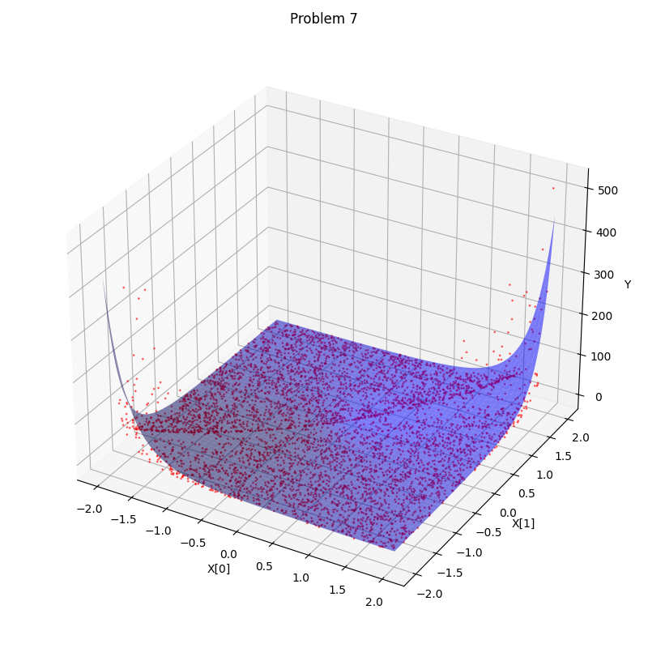

# Project report
Michele Cazzola - s323270
## Overview

This project is carried out using a GP approach, by evolution of tree-based individuals.
The main components: are the following
- `Individual`: define a single individual, with its genome and the corresponding MSE
- `Tree`: foundation class of the project, encodes the genome of an individual
- `OperatorCollection`: collection of the operators used in the project, as wrappers for NumPy or Python-basic operators
- `Operator`: defines a single operator and some utilities to store information about it
- `solve(...)`: function to solve the problem by apply genetic programming

The experiments are performed with particular focus on the trade-off between execution time and final performance, due to the limited computational power available.

In the repository, you can find:
- `data/`: folder with problem datasets
- `results/`: divided into
  - `problems/`: contains MSE, final expression and plots for each problem
  - `experiments/`: contains MSE and final expression for some additional experiments performed, many of them are preliminary ones, used to tune hyperparameters
- `src/`: contains:
  - `symreg.ipynb`: notebook where the solution is implemented
  - `eval.ipynb`: evaluation notebook, used to compute final MSE and some plots for each problem; needs to be moved one level above to work, since it imports the main file
- `s323270.py`: main file with functions
- `experiments_log.md`: file with additional experiments, whose results are stored into `results/experiments/`
 
The project is performed alone. Some exchange of ideas has been done with Vincenzo Avantaggiato (s323112), but the implementation and the execution of the experiments has been done autonomously.

## Methodology
### Tree
The `Tree` class has been implemented from scratch.
It encodes the genome of an individual and each node is defined as an object of class `Tree` itself, that can be:
- a *leaf*: constant or variable, without any children
- an *operator node*: operator, with one or two children; generalized operator, such as N-ary sum or multiplication are not defined: if needed, these operations can be performed with binary ones in cascade. 

#### Creation
A tree is created upon individual creation (`create_individual`):
1. First, it is instantiated
2. Second, a random subtree is recursively created and attached to it as root element
3. Finally, it is returned to the caller

Whereas variables and operators are given from the caller (see later), constants are given as bounds:
- at tree creation, the size of the constants pool is defined as max(1000, 1000 * (upper - lower))
- when choosing the value of a leaf, values of the constants are uniformly sampled from a linearly spaced (deterministic) distribution, computed using the bounds and the pool size; the number of extracted values is such that the probability of sampling a constant from a pool with variables is equal to a given parameter: here, this parameter (`constant_prob_leaf`) is 0.5, so the number of extracted constants is equal to the number of variables.

The decision of creating an operator or a leaf node is:
- random: the probability being a leaf is linear in the depth of the current node, with respect to the maximum possible depth
- constrained: when maximum depth is reached, the node must be a leaf.

#### Mutation
Mutation type is randomly chosen with uniform probability, between:
- `point`: mutates a single random point in the tree; the mutation is divided between:
  - *leaf node*: it remains a leaf node, with an equal probability of becoming a constant or a variable
  - *operator node*: it remains an operator node and arity is preserved
- `subtree`: chooses a non-leaf node and attaches to it a newly created random subtree, in place of an existing one

#### Crossover
A single type of crossover is computed (`exchange`): it takes two different individuals and returns a new one, with the whole structure from the first, except for a random subtree, taken from the second one

#### Evaluation
The evaluation is performed with recursive propagation of each point of the dataset into the tree. The final result is `100 * MSE`, the same metric used for final evaluation.

*Note*: to discard individuals (formulas) that provide invalid results during training, their MSE is manually set to `inf`; they are easily detecting by checking whether at least one of the predicted values is `NaN`. 

#### Other functionalities
Other functionalities are:
- `merge`: takes a list of trees and sums them together; it is used when performing K-fold cross-validation
- `draw`: draws the tree
- `to_math_notation`: converts the tree into a mathematical formulation, ready to be copy and pasted on the main file (or directly evaluated to perform further computation)

### OperatorCollection
Defines the operators used in this project:
- `add`: binary sum
- `sub`: binary subtraction
- `mul`: binary multiplication
- `neg`: unary negation
- `sin`: sine
- `cos`: cosine
- `exp`: exponentiation
- `cosh`: hyperbolic cosine
- `sinh`: hyperbolic sine

The last three ones are sometimes not used, since the results have been better without, for performance or execution time purposes. The motivation could be their common exponential trend.

The usage of operators with limited domain is completely avoided: this could be a limitation in the learning capability of the process, but using them would require a careful handling of invalid inputs, both at training and inference time.

### Operator
This class defines the operator object, with some useful information:
- `symbol`: the operator notation, visualized when printing a formula or drawing the tree
- `function`: the operator function, represented by one of the `OperatorCollection` functions and called when the operator object is invoked
- `arity`: the number of operands the operator accepts; it is set manually in creation and it can be only 1 or 2.

### Solution strategy

#### Population, variables and constants
The population is created once before training:
- `operators` are those defined before
- `variables` are taken from the problem specification: they are as many as the dataset dimensionality, encoded as `'xN'` where `N` is a number identifying the dimension, from 0 onwards
- `constants`: only constant bounds are defined here, the computation of the values is left to the `Tree` class

#### Solve function
The `solve` function performs an iteration on the population:
- for a given number of generations
- for each generation, an offspring is generated and evaluated

**Main elements**:
- *parent selection*: tournament selection, the parent is the best individual in a randomly chosen bucket, whose size is a hyperparameter
- *population management model*: steady-state, offspring competes with the parent to survive
- *survivor selection*: deterministic; only the best individuals are retained
- *flow*: hyper-modern, with mutation or crossover either performed
- *evaluation*: both at the beginning and at each iteration, the population is evaluated on training/validation set, depending on the `Modality`.

**Other functionalities**:
- *length penalty*: a common observed phenomenon is the huge growth of the trees, mainly due to crossover operations, leading to a slow down of the algorithm when generations advance; therefore, a penalty for larger trees is applied directly in MSE evaluation, as follows: 100 * (1 + LP * tree_length) \cdot MSE. However, this could lead to an earlier takeover and worse performance, indeed it has been subject of tuning, especially in case of complex instances.
- *restarting*: it has been observed that the performance could benefit the restarting of the process; in some cases, after a given number of missing changes in the fittest individual MSE, as measured with relative difference, the population is restarted: all individuals are killed, except for the current champion (it is a sort of *elitism*), and replaced with new random ones. Sometimes has worked in this project, since the new individuals take more variability to the population. If penalty is dependent by the current generation, its reference is set to 0 after restarting.

#### Training modalities and dataset splits
Regarding the training modality, it is possible to:
- *training only*: the algorithm is trained on the whole dataset, without any splitting, and evaluated on the same samples; could suffer of bias, but simple and consistent results;
- *single-split cross-validation*: the algorithm is trained on a portion of the dataset and it is evaluated on the other one; it has more generalization capabilities, but it is less consistent and it uses less data. Moreover, data distribution could be too much diverse across the different splits, leading to garbage results even when the approximation is good
- *K-fold cross-validation*: K algorithms are trained on the whole dataset except a fold, then each one is evaluated on a single fold; finally, the resulting individuals are merged into a single one, using the `merge` functionality of the tree. A weighted merge (that is, a weighted sum) could be better than a simple merge, especially if it is weighted on the inverse of the MSE. This method is more robust, but very time consuming: experiments have shown it is unfeasible to run this method for hundreds of generations.

In *training* modality, it is possible to downsample the dataset: by supposing the samples follow the same probability distribution in their space and by supposing the benchmark ones have the same property, it is possible to reduce the dataset cardinality; this allows to train for more generations, reaching better results. Experiments have shown that in many cases the dataset reduction lead to MSE results that are the same if computed on the whole dataset: this means that the formula computed on a small portion of the dataset approximates the whole data distribution as well as it approximates the reduced data distribution.

## Experiments and results
Several experiments have been made:
- in the following sections are reported only the official ones, but more details about the others can be found in the Github repository (even if in a quite raw style)
- the unofficial ones regard in general preliminary steps made to tune the hyperparameters.

The experiments have been carried out under the following base assumption:
```
The data distribution of the provided training set is the same as the data distribution of the benchmark dataset, used in final evaluation and unknown during this phase.
```
Therefore, it has been decided to use the `train` modality for official runs, also after observations of experimental results. This allows using easily all provided data.

As previously said:
- a frequent use of dataset downsampling has been made, both for the reasons described above and due to experimental results
- lenght penalty has been tuned to achieve the best possible results, in particular in some complex instances.

### Hyperparameters

| Problem | Modality | Training set size | Max depth | Constants range (1) | Bucket size | Offspring size | Population size | Generations | Mutation probability | Length penalty | Restart size | 100*MSE |
|:---------:|:---------:|:---------:|:---------:|:---------:|:---------:|:---------:|:---------:|:---------:|:---------:|:---------:|:---------:|:---------:|
| 1 | Train | 500 | 10 | 2 | 3 | 30 | 100 | 100 | 0.02 | 0 | - | 7.125e-32 |
| 2 | Train | 500 | 10 | 2 | 3 | 30 | 100 | 300 | 0.02 | 0 | - | 1.904e+15 |
| 3 | Train | 500 | 10 | 2 | 3 | 30 | 100 | 500 | 0.02 | 0.01 | 30 (1) | 7484.06 |
| 4 | Train | 500 | 10 | 2 | 3 | 30 | 100 | 200 | 0.02 | 0 | - | 6.860 |
| 5 | Train | 500 | 10 | 0.001 | 10 | 30 | 100 | 300 | 0.02 | 0 | - | 1.884e-17 |
| 6 | Train | 500 | 10 | 2 | 3 | 30 | 100 | 200 | 0.02 | 0 | - | 1.630e-3 |
| 7 (2) | Train | 5000 | 10 | 2 | 3 | 30 | 100 | 200 | 0.02 | 0.001 | 30 | 32498.9 |
| 8 | Train | 5000 | 10 | 2 | 10 | 30 | 100 | 300 | 0.1 | (3.1) | 30(3.2) | 1.171e+08 |

1. The actual constant range is computed as [-CR, CR], where CR is the constant range in the table 
2. Relative tolerance for steady state is set to 5e-3
3. Relative tolerance for steady state 1e-6
4. &nbsp;  
   1. Length penalty computed as: `LP = 0.5 * (0.001 - 1e-6 ) * (cos(pi * g / 25) +1 ) + 1e-6, if g < 25, else -> 0`, where *g* is the generation number
   2. Relative tolerance for steady state 1e-6

Here there is the plot of length penalty trend in case `4.1`: the smooth decreasing is useful to avoid the trees to be too large in the beginning, while keeping them free to grow later, to avoid an early takeover.


### Formulas and results
| Problem | Formula | 100 * MSE |
|:--:|:--:|:--:|
|1| `np.sin(x[0])` |7.125e-32|
|2| `(((((-(-8.583) + -7.783) + ((x[1] - -((5.431 * 4.621))) - (-7.014 - 1.482))) * (0.882 - -((((-8.583 + ((-(-8.583) + (((np.cos(0.844) * (((0.882 - 1.482) - 1.482) * (np.cos((-1.876 + -(0.283))) * 5.500))) + np.abs((-1.876 + -(0.283)))) + np.sin(0.844))) + ((0.882 + 5.431) - x[0]))) + 0.882) * 4.621)))) - (np.abs((-((np.abs((((3.810 - (-(-8.583) * (x[1] - -(((-7.548 + 0.882) * 4.621))))) * 9.486) * -1.692)) + -3.815)) - x[1])) * (-9.234 + ((-(-8.583) + -7.783) + ((0.882 + -(-8.583)) - x[0]))))) * ((((-1.876 + (((np.cos(0.844) * (((0.882 - 0.844) - 1.482) * (np.cos((-9.234 + ((-(-8.583) + (((np.cos(0.844) * (((0.882 - 1.482) - 1.482) * (np.cos((-1.876 + -(0.283))) * 5.500))) + np.abs((-1.876 + -(0.283)))) + np.sin(0.844))) + ((0.882 + 5.431) - x[0])))) * 5.500))) + np.abs(-7.548)) + np.sin(0.844))) * ((-7.014 - 1.482) * (np.cos((-1.876 + -(0.283))) * 5.500))) + np.abs(-7.548)) + np.sin(0.844)))` |1.904e+15|
|3| `(np.cosh(np.sinh(-1.647)) + ((((((np.cosh(x[0]) - x[2]) - x[2]) - x[2]) - x[1]) - np.sinh(x[1])) - np.sinh(x[1])))` |7484.06|
|4| `(-((-(np.cos(np.abs(x[1]))) - -((-(np.cos(np.abs(np.abs(-(x[1]))))) - np.cos(np.abs(x[1])))))) - (-(-((-(np.cos(x[1])) - -((-(np.cos(-1.719)) - -(((-(np.cos(x[1])) - np.cos(np.abs(x[1]))) - -(-1.719)))))))) - -((-(np.cos(x[1])) - -(-1.719)))))` |6.859|
|5| `((-(np.cosh(x[1])) * -1.011e-04) * np.sinh(((((((7.738e-04 * -(np.cosh((np.sinh((((-(np.cosh(x[1])) * x[0]) + 7.738e-04) * 7.738e-04)) * x[0])))) * x[0]) + 7.738e-04) * x[0]) + (7.738e-04 * -(-(np.cosh(np.sin((((7.738e-04 * ((((7.738e-04 * -(np.cosh((np.sinh((((-(np.cosh(x[1])) * x[0]) + np.cosh(-1.011e-04)) * (((7.738e-04 * -(np.cosh((np.sinh((((-(np.cosh(x[1])) * x[0]) + 7.738e-04) * 7.738e-04)) * x[0])))) * x[0]) + 7.738e-04))) * x[1])))) * x[0]) + 7.738e-04) * -1.011e-04)) * -(np.cosh(x[1]))) + (x[1] * np.cosh((((7.738e-04 * (-(np.cosh(x[1])) * np.sin((((7.738e-04 * x[0]) * x[0]) + (((((((7.738e-04 * (-(np.cosh(x[1])) * x[0])) * x[0]) + 7.738e-04) * np.sin((x[0] + np.cosh(np.sin((x[0] + (x[1] * -(np.cosh(x[1]))))))))) + (7.738e-04 * -(-(np.cosh(np.sin((np.sin(-((x[0] * -1.011e-04))) + (x[1] * np.cosh(x[1]))))))))) * (-(np.cosh(np.sin(-(((-(np.cosh(x[1])) * x[0]) * -1.011e-04))))) * -1.011e-04)) * (7.738e-04 * -(7.738e-04))))))) * x[0]) + (x[1] * x[1]))))))))))) * (-(np.cosh(np.sin(-((-(np.cosh(x[1])) * -1.011e-04))))) * -1.011e-04))))` |1.884e-17|
|6| `(((-0.203 * (((-0.203 * (np.sin(np.cos((0.928 + ((-0.203 * (np.sin(np.cos((0.928 + (-0.363 + -(x[1]))))) + (0.928 + x[1]))) + (-0.363 * (-0.203 * (x[0] + x[0]))))))) + ((x[1] + x[0]) + -0.203))) * -0.363) + ((x[1] + x[0]) + (-(-(x[0])) - -(x[0]))))) + x[1]) - (-(x[1]) + ((-0.203 * (((-0.203 * (-0.203 + ((x[1] + (0.928 + x[1])) + (2.000 + np.sin(np.cos((0.928 + ((-0.203 * (np.sin(np.cos((-0.203 * (np.sin(np.cos(np.sin(np.sin(np.cos(np.sin(np.cos((0.928 + ((x[1] + x[0]) + -((np.sin(2.000) + (x[1] + -0.363)))))))))))) + ((-0.363 * (np.sin(np.cos((0.928 + (((-0.203 * (-0.203 + ((x[1] + ((-0.363 * (-0.363 + (x[1] + x[1]))) * x[1])) + (2.000 + np.sin(np.cos((0.928 + ((-0.203 * (np.sin(np.cos((-0.203 * (np.sin(np.cos(np.sin(np.sin(np.cos(np.sin(np.cos((0.928 + ((x[1] + x[0]) + -((np.sin(2.000) + (x[1] + -0.363)))))))))))) + ((-0.363 * (np.sin(np.cos((0.928 + ((x[1] * (x[0] + x[0])) + (np.sin(np.cos((x[1] + -0.363))) * (-0.203 * (x[0] + x[0]))))))) + (x[1] + x[1]))) * x[1]))))) + ((np.sin(np.cos(np.sin(np.cos((0.928 + (((np.sin(-0.363) + ((x[1] + x[0]) + -0.203)) + x[0]) + -((np.sin(2.000) + (x[1] + x[0]))))))))) + ((x[1] + x[0]) + -0.203)) + 0.928))) + (-0.363 * (-0.203 * ((0.928 + ((-0.203 + (-0.203 * (np.sin(np.cos(np.sin(np.cos((np.sin(np.cos((-0.203 * (np.sin(np.cos(np.sin(np.sin(np.cos(np.sin(np.cos((0.928 + ((x[1] + x[0]) + -((-0.363 + (x[1] + -0.363)))))))))))) + ((-0.363 * (np.sin(np.cos((0.928 + ((x[1] * (x[0] + x[0])) + (np.sin(np.cos((x[1] + -0.363))) * (-0.203 * (x[0] + x[0]))))))) + (x[1] + x[1]))) * x[1]))))) + ((np.sin(np.cos(np.sin(np.cos((0.928 + (((np.sin(np.cos(np.cos(np.sin(np.sin(np.cos(np.sin(np.sin(np.cos((-0.203 * (np.sin(np.cos(np.sin(np.cos((x[1] + 0.928))))) + ((np.sin(np.cos(np.sin(np.cos((x[1] + 0.928))))) + ((x[1] + x[0]) + -0.203)) + -0.203)))))))))))) + ((x[1] + x[0]) + -0.203)) + x[0]) + -((np.sin(2.000) + (x[1] + x[0]))))))))) + ((x[1] + x[0]) + -0.203)) + 0.928)))))) + ((-0.363 * (-0.363 + ((np.sin(np.cos((0.928 + ((x[1] * (x[0] + x[0])) + (np.sin(np.cos((x[1] + -0.363))) * (-0.203 * (x[0] + x[0]))))))) + (x[1] + x[1])) + x[1]))) * x[1])))) + -((np.sin(2.000) + 1.591)))) + x[0]))))))))))) * -0.363) + (np.sin(np.cos((x[1] + -0.363))) * (-0.203 * (x[0] + (x[1] + -0.363)))))))) + (x[1] + x[1]))) * x[1]))))) + ((np.sin(np.cos(np.sin(np.cos((0.928 + (((np.sin(np.cos(np.cos(np.sin(np.sin(np.cos((-0.203 * (np.sin(np.cos((x[0] + ((-0.203 * (np.sin(np.cos((0.928 + (-0.363 + -(x[1]))))) + (0.928 + x[1]))) + (-0.363 * (-0.203 * (x[0] + x[0]))))))) + ((x[1] + x[0]) + -0.203))))))))) + ((x[1] + x[0]) + -0.203)) + x[0]) + -(((-0.363 * (np.sin(np.cos((0.928 + ((x[1] * (x[0] + ((x[1] + x[0]) + -0.203))) + (np.sin(np.cos((x[1] + -0.363))) * (-0.203 * (x[0] + x[0]))))))) + (x[1] + x[1]))) + (x[1] + x[0]))))))))) + ((x[1] + x[0]) + -0.203)) + 0.928))) + (-0.363 * (-0.203 * ((0.928 + ((-0.203 + (-0.203 * (np.sin(np.cos((0.928 + x[1]))) + ((-0.363 * (-0.363 + (np.sin(np.cos(np.sin(np.cos((0.928 + (x[1] + x[0])))))) + ((-0.363 * (-0.363 + (x[1] + x[1]))) * x[1])))) * x[1])))) + -((np.sin(2.000) + 1.591)))) + x[0]))))))))))) * -0.363) + ((x[1] + x[0]) + -0.363))) * -0.363)))` |1.630e-3|
|7| `np.exp(np.exp((0.584 - ((0.215 * -1.424) * (x[1] * x[0])))))` |32498.9|
|8| `np.sinh((((x[5] + np.cos(x[5])) + x[5]) + (np.sin(((-2.000 + np.cos(((x[5] + np.cos(np.sin(((-2.000 + np.cos((x[5] + np.cos(np.sin(x[5]))))) + (x[5] + (x[5] + np.cos(np.sin(((-2.000 + np.cos((x[5] + np.cos(x[5])))) + (np.cos(np.sin(((-2.000 + np.cos((x[5] + np.cos(x[5])))) + (((x[5] + np.cos(np.sin((np.sin(((x[5] + np.cos((x[5] + x[5]))) + (((x[5] + np.cos(x[5])) + x[5]) + (np.sin(((-2.000 + np.cos(-2.000)) + (x[5] + np.cos(-2.000)))) + 0.159)))) + (x[5] + np.cos(-2.000)))))) + np.cos(-2.000)) + np.sin(((-2.000 + np.cos(((x[5] + np.cos(np.sin(((-2.000 + np.cos((x[5] + np.cos(np.sin(x[5]))))) + (x[5] + (x[5] + np.cos(np.sin(((-2.000 + np.cos((x[5] + np.cos(x[5])))) + (np.cos(np.sin(((-2.000 + np.cos((x[5] + np.cos(x[5])))) + (((x[5] + np.cos(x[5])) + np.cos(-2.000)) + np.cos(-2.000))))) + ((-2.000 + (x[5] + np.cos(np.sin(((-2.000 + np.cos((x[5] + np.cos(-2.000)))) + (0.159 + np.cos(-2.000))))))) + np.cos(x[5])))))))))))) + np.cos(-2.000)))) + (x[5] + np.cos((-2.000 + np.cos(-1.306)))))))))) + (x[5] + np.cos(x[5])))))))))))) + np.cos(-2.000)))) + (x[5] + np.cos(-2.000)))) + 0.159)))` |1.171e+08|

### Tree and MSE
|Problem|Tree|MSE|
|:--:|:--:|:--:|
| 1 |    |     |
| 2 |      |      |
| 3 |      |      |
| 4 |      |      |
| 5 |      |      |
| 6 |      |     |
| 7 |      |      |
| 8 |      |      |

### Plots
For each of the problems, they have been produced:
- per-dimension plots: comparison between projected data and predictions, made with other dimensions zeroed
- 3D plot if the dataset is 2-dimensional

|Problem|Plots|3D plot|
|:--:|:--:|:--:|
| 1 |    |    |
| 2 |       |     |
| 3 |        |    |
| 4 |      |      |
| 5 |      |      |
| 6 |      |     |
| 7 |      |      |
| 8 |           |    |


## Conclusion
This project implemented symbolic regression using genetic programming. Various techniques and strategies have been employed, as well as hyperparameter tuning and trade-offs between execution time and performance.

Some instances have been successfully solved (1, 5, 6), some partially (4), whereas others would need more research to reach the results of the solved ones, since many experiments have been carried out, with no particular success.

Further improvements could be the implementation of efficient trees to limit the slow down due to recursion operation, the employment of more sophisticate techniques of sampling and mutation, and the efficient and effective usage of K-fold cross-validation, to find a formula robust to data variations.

## Appendix: experiments log

Data is shown in raw way, but it is still comprehensible.
Each ID corresponds to data (images of tree formula and MSE, there called *loss*) stored in the Github repository, at the path `/results/experiments`

| ID | Problem | Reduction factor |Test size|Constants range|Bucket size|Offspring size|Pop size| Generations| Mutation (s) (*) | Train MSE | Val MSE | Notes |
|:--:|:--:|:--:|:--:|:--:|:--:|:--:|:--:|:--:|:--:|:--:|:--:|:--:|
|20250802_0052|1|1|0.1|20|10|10|30|20|P|6.27e-34|1.48e-33||
|20250802_0200|1|1|0.1|20|10|10|30|20|P|6.03e-7|6.03e-7||
|20250802_0215|5|1|0.1|20|10|10|30|20|P|5.60529e-16|5.28052e-16| |
|20250902_0044|6|1|0|20|3|30|100|50|P|1.85|-|  |
|20250902_0200|6|0.06|0|20|3|30|100|100|P+ST|1.85|-|  |
|20250902_0215|6|0.06|0|20|3|30|100|100|P+ST|1.85|-|  |
|20250209_2323|6|0.1|-|2|3|30|100|500|P+ST|0.038333|-|  |
|20250211_2245|6|0.1|-|2|3|30|100|200|P+ST|-|-|  LP=0, Const prob = 0.5, No exp|
|20250211_2325|6|0.1|-|2|3|30|100|300|P+ST|1.63e-3|-|  LP=0, Const prob = 0.5, No exp|
|20250210_0125|4|0.1|-|2|3|30|100|300|P+ST|6.85984|-|   Penalty 0 |
|20250210_0207|2|0.1|-|2|3|30|100|300|P+ST|1.9e+15|-| Length penalty 0|
|20250210_0310|7|1|-|2|3|30|100|50|P+ST|35187.6|-|  Length penalty 0.001, go up to 100-200, takes a lot of time|
|20250210_0335|8|0.1|-|2|3|30|100|50|P+ST|7.75e+8|-|  Length penalty 0.001, go up to 100-200, takes a lot of time|
|20250210_0330|3|0.1|-|2|3|30|100|500|P+ST|14830.1|-|  Length penalty 0.001|
|20250810_0340|1|1|-|2|3|10|30|30|P+ST|7.12e-32|-|LP = 0|
|20250812_0000|1|0.2|-|2|3|30|100|100|P+ST|7.126e-32|-|LP = 0, CP=0|
|20250210_1330|7|1|-|2|3|30|100|200|P+ST|32953|-|  LP = 0.001, |
|20250210_1350|7|1|-|2|3|30|100|200|P+ST|32498.9|-|  LP = 0.001, restart with SS = 30, reltol 1e-6, retain quantity=1 (ch only)|
|20250210_1400|8|0.1|-|2|3|30|100|200|P+ST (0.1)|1.17e+08|-| LP = 0.5 * (0.001 - 1e-6) * (cos(pi * g / 25)+1) + 1e-6 if g < 25 else 0, g wrt restart, restart with SS = 30, reltol 1e-6, retain quantity=1 (ch only)|
|20250210_1440|3|0.1|-|2|3|30|100|200|P+ST|8589|-|  LP = 0.01 restart with SS = 30, reltol 1e-3, retain quantity=1 (ch only)|
|20250210_1520|3|0.1|-|2|3|30|100|500|P+ST|7484.06|-|  LP = 0.01 restart with SS = 30, reltol 5e-3, retain quantity=1 (ch only)|
|20250210_1620|5|0.1|-|0.001|10|30|100|200|P+ST|1.88e-17|-|LP=0|


*Notes*:  
- (*): P indicates point mutation, ST subtree mutation  
- crossover is always subtree exchange
- max depth is always set to 10